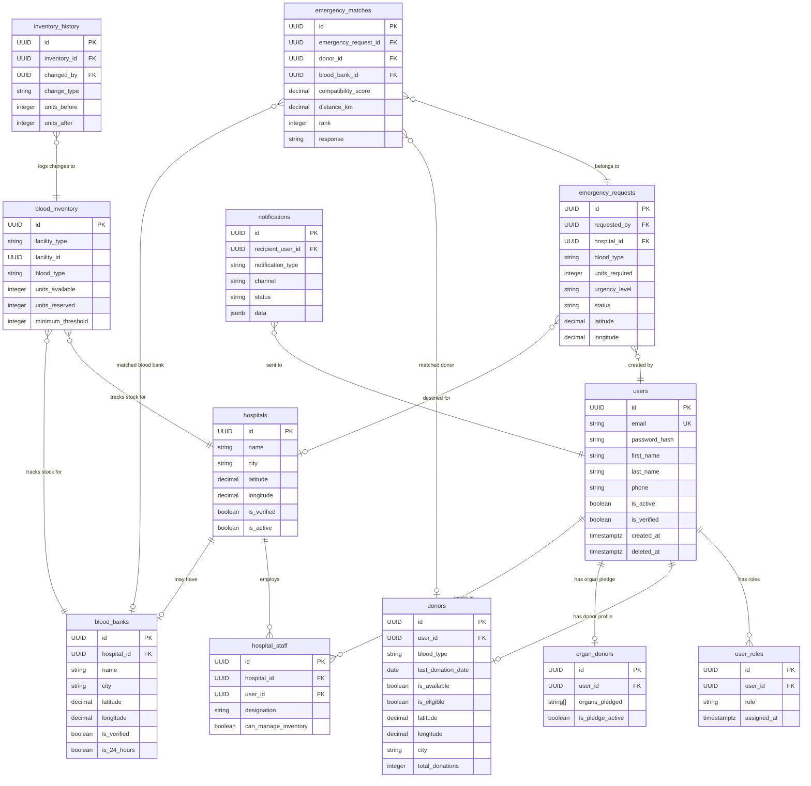

# LifeLink AI — Database Design Document

```
Version      : 3.6
Status       : Active Production Schema — Synchronized through Phase 1.7 + Donor Response
Database     : PostgreSQL 16 (asyncpg driver)
Alembic Head : g9263047a8f6 (7 migrations applied)
Authors      : LifeLink AI Engineering Team
Last Updated : 2026-09-08
Derived From : ARCHITECTURE.md v3.5
```

> **Authority & Schema Ground Truth**
> This document derives all decisions from `ARCHITECTURE.md`.
> It reflects the exact implemented database schema in PostgreSQL as defined by SQLAlchemy models and Alembic migrations.

---

## Table of Contents

- [1. Database Technology Decision](#1-database-technology-decision)
- [2. Global Standards](#2-global-standards)
- [3. Naming Conventions](#3-naming-conventions)
- [4. Schema Overview](#4-schema-overview)
- [5. Module: Auth](#5-module-auth)
- [6. Module: Donor](#6-module-donor)
- [7. Module: Hospital](#7-module-hospital)
- [8. Module: Blood Bank](#8-module-blood-bank)
- [9. Module: Inventory](#9-module-inventory)
- [10. Module: Emergency](#10-module-emergency)
- [11. Module: Matching Engine](#11-module-matching-engine)
- [12. Future / Planning Placeholders](#12-future--planning-placeholders)
- [13. Conceptual ER Diagram](#13-conceptual-er-diagram)
- [14. Relationships Summary](#14-relationships-summary)
- [15. Indexes](#15-indexes)
- [16. Foreign Keys](#16-foreign-keys)
- [17. Blood Type Reference Data](#17-blood-type-reference-data)
- [18. Enum Definitions](#18-enum-definitions)
- [19. Migration Strategy & Applied History](#19-migration-strategy--applied-history)
- [20. Future Schema Extensions](#20-future-schema-extensions)

---

## 1. Database Technology Decision

**Primary Database:** PostgreSQL 16  
**ORM:** SQLAlchemy 2.x (async engine with asyncpg)  
**Migration Tool:** Alembic (Current Head: `f8152936a7e5`)  
**Async Driver:** asyncpg  
**Extensions:** `uuid-ossp`, `pgcrypto`  

---

## 2. Global Standards

Every table in this database follows these universal rules:
- **UUID Primary Keys**: Generated via PostgreSQL `gen_random_uuid()` or Python `uuid4`.
- **UTC Timestamps**: `created_at` and `updated_at` stored with timezone (`TIMESTAMPTZ`).
- **Integrity Constraints**: Foreign keys with `ON DELETE CASCADE` or `ON DELETE SET NULL` where appropriate; strict `CHECK` constraints on stock quantities and ranges.

---

## 4. Schema Overview

### Implemented Active Tables (Phases 1.1–1.7)

| Module | Table Name | Key Columns & Indexes | Implemented in Migration |
|---|---|---|:---:|
| **auth** | `users` | `id`, `email` (UNIQUE), `password_hash`, `full_name`, `phone`, `is_active`, `is_verified` | `b4712859c3a1` |
| **auth** | `user_roles` | `user_id` (FK), `role` (ENUM), `granted_at`, `granted_by` (FK) | `b4712859c3a1` |
| **donor** | `donors` | `id`, `user_id` (UNIQUE FK), `blood_type`, `gender`, `weight_kg`, `city`, `state`, `pincode`, `latitude`, `longitude`, `is_available`, `is_eligible`, `last_donation_date` | `c5823960d4b2` |
| **hospital** | `hospitals` | `id`, `name`, `license_number` (UNIQUE), `hospital_type`, `address`, `city`, `state`, `pincode`, `latitude`, `longitude`, `contact_phone`, `contact_email`, `is_verified` | `d6934071e5c3` |
| **hospital** | `hospital_staff` | `id`, `hospital_id` (FK), `user_id` (FK), `role_in_hospital`, `is_primary_contact` | `d6934071e5c3` |
| **blood_bank** | `blood_banks` | `id`, `name`, `license_number` (UNIQUE), `bank_type`, `address`, `city`, `state`, `pincode`, `latitude`, `longitude`, `contact_phone`, `contact_email`, `is_verified` | `d6934071e5c3` |
| **inventory** | `blood_inventory` | `id`, `facility_type`, `facility_id`, `blood_type`, `component`, `units_available`, `units_reserved`, `expiry_date`, `batch_number` | `e7045182f6d4` |
| **inventory** | `inventory_history` | `id`, `inventory_id` (FK), `action`, `units_changed`, `reason`, `performed_by` (FK), `notes` | `e7045182f6d4` |
| **emergency** | `emergency_requests` | `id`, `request_code` (UNIQUE), `requester_type`, `hospital_id` (FK), `patient_name`, `blood_type`, `units_requested`, `urgency_level`, `status`, `city`, `contact_phone` | `a2370546e98c` |
| **matching** | `match_runs` | `id`, `emergency_request_id` (FK), `search_radius_km`, `total_candidates_found`, `blood_banks_found`, `donors_found`, `execution_duration_ms`, `algorithm_version`, `status` | `f8152936a7e5` |
| **matching** | `match_candidates` | `id`, `match_run_id` (FK), `candidate_type`, `facility_id` (FK), `donor_id` (FK), `compatibility_score`, `proximity_score`, `availability_score`, `response_propensity_score`, `total_score`, `rank`, `distance_km`, `explanation` (JSONB), `status` | `f8152936a7e5` |
| **donor** | `donor_emergency_responses` | `id`, `emergency_request_id` (FK), `donor_id` (FK), `response_status`, `notes`, `responded_at` | `g9263047a8f6` |

### Planning / Future Table Placeholders (Post-1.7)
The following tables exist in architecture specifications for future milestones and are **not yet migrated in PostgreSQL**:
- `notifications` (Phase 1.8 SMS/FCM integration)
- `organ_donors` (Version 2.0 Organ Allocation)
- `analytics_snapshots` (Version 2.0 BI Reporting)
- `password_reset_tokens` (Future self-serve token recovery)

---

## 5. Module: Auth

**Owner:** Developer 1
**Description:** Stores all user accounts and authentication data for every role in the system. No other module stores user identity — this is the single source of truth for who a person is.

---

### Table: `users`

The central identity table. Every stakeholder in the system — donor, hospital admin, blood bank manager, patient, government analyst, system admin — has exactly one row here.

| Column | Type | Nullable | Default | Description |
|---|---|---|---|---|
| `id` | UUID | NO | gen_random_uuid() | Primary key |
| `email` | VARCHAR(255) | NO | — | Unique login identifier |
| `password_hash` | VARCHAR(255) | NO | — | bcrypt hash, cost factor 12 |
| `first_name` | VARCHAR(100) | NO | — | Given name |
| `last_name` | VARCHAR(100) | NO | — | Family name |
| `phone` | VARCHAR(20) | YES | NULL | Contact number |
| `is_active` | BOOLEAN | NO | TRUE | Account active/disabled |
| `is_verified` | BOOLEAN | NO | FALSE | Email verified |
| `last_login_at` | TIMESTAMPTZ | YES | NULL | Timestamp of last successful login |
| `created_at` | TIMESTAMPTZ | NO | NOW() | Account creation |
| `updated_at` | TIMESTAMPTZ | NO | NOW() | Last modification |
| `deleted_at` | TIMESTAMPTZ | YES | NULL | Soft delete |

**Constraints:**
- `UNIQUE (email)` — one account per email address
- `CHECK (email LIKE '%@%.%')` — basic email format
- Password hash is never returned in any API response

---

### Table: `user_roles`

Assigns one or more roles to a user. A user can hold multiple roles (e.g., a doctor who is also a registered donor).

| Column | Type | Nullable | Default | Description |
|---|---|---|---|---|
| `id` | UUID | NO | gen_random_uuid() | Primary key |
| `user_id` | UUID | NO | — | References `users.id` |
| `role` | user_role_enum | NO | — | Role assignment |
| `assigned_at` | TIMESTAMPTZ | NO | NOW() | When role was assigned |
| `assigned_by` | UUID | YES | NULL | Admin user who assigned role |
| `created_at` | TIMESTAMPTZ | NO | NOW() | Record creation |
| `updated_at` | TIMESTAMPTZ | NO | NOW() | Last modification |
| `deleted_at` | TIMESTAMPTZ | YES | NULL | Soft delete (role revocation) |

**Constraints:**
- `UNIQUE (user_id, role)` — a user cannot have the same role twice
- `FOREIGN KEY (user_id) REFERENCES users(id) ON DELETE CASCADE`

**Role enum values:** `SUPER_ADMIN`, `HOSPITAL_ADMIN`, `BLOOD_BANK_MANAGER`, `DONOR`, `ORGAN_DONOR`, `PATIENT`, `NGO_COORDINATOR`, `AMBULANCE_OPERATOR`, `GOVERNMENT_ANALYST`

---

### Table: `password_reset_tokens`

Stores temporary tokens for password reset flows. Tokens expire after 15 minutes.

| Column | Type | Nullable | Default | Description |
|---|---|---|---|---|
| `id` | UUID | NO | gen_random_uuid() | Primary key |
| `user_id` | UUID | NO | — | References `users.id` |
| `token_hash` | VARCHAR(255) | NO | — | SHA-256 hash of reset token |
| `expires_at` | TIMESTAMPTZ | NO | — | Expiry (created_at + 15 minutes) |
| `used_at` | TIMESTAMPTZ | YES | NULL | When token was consumed (one-time use) |
| `created_at` | TIMESTAMPTZ | NO | NOW() | Token creation |

**Constraints:**
- `UNIQUE (token_hash)` — each token is unique
- `FOREIGN KEY (user_id) REFERENCES users(id) ON DELETE CASCADE`

---

## 6. Module: Donor

**Owner:** Developer 1
**Description:** Stores donor-specific profile data. Every donor is also a `users` record. This table extends the identity with donation-specific information.

---

### Table: `donors`

| Column | Type | Nullable | Default | Description |
|---|---|---|---|---|
| `id` | UUID | NO | gen_random_uuid() | Primary key |
| `user_id` | UUID | NO | — | References `users.id` — one-to-one |
| `blood_type` | blood_type_enum | NO | — | ABO + Rh blood type |
| `date_of_birth` | DATE | NO | — | Used to verify minimum age (18+) |
| `gender` | gender_enum | YES | NULL | Biological sex — relevant for certain donations |
| `weight_kg` | DECIMAL(5,2) | YES | NULL | Minimum 50kg required to donate |
| `address_line` | VARCHAR(255) | YES | NULL | Street address |
| `city` | VARCHAR(100) | YES | NULL | City of residence |
| `state` | VARCHAR(100) | YES | NULL | State of residence |
| `pincode` | VARCHAR(10) | YES | NULL | Postal code |
| `latitude` | DECIMAL(10,8) | YES | NULL | Geocoded latitude |
| `longitude` | DECIMAL(11,8) | YES | NULL | Geocoded longitude |
| `is_available` | BOOLEAN | NO | TRUE | Availability toggle — controlled by donor |
| `is_eligible` | BOOLEAN | NO | TRUE | System-computed eligibility (cooldown, health) |
| `last_donation_date` | DATE | YES | NULL | Date of most recent donation |
| `total_donations` | INTEGER | NO | 0 | Lifetime donation count |
| `medical_conditions` | TEXT[] | YES | NULL | Known conditions affecting eligibility |
| `fcm_token` | VARCHAR(512) | YES | NULL | Firebase Cloud Messaging device token |
| `notification_email` | BOOLEAN | NO | TRUE | Consent to email notifications |
| `notification_push` | BOOLEAN | NO | TRUE | Consent to push notifications |
| `created_at` | TIMESTAMPTZ | NO | NOW() | Profile creation |
| `updated_at` | TIMESTAMPTZ | NO | NOW() | Last modification |
| `deleted_at` | TIMESTAMPTZ | YES | NULL | Soft delete |

**Constraints:**
- `UNIQUE (user_id)` — one donor profile per user
- `FOREIGN KEY (user_id) REFERENCES users(id) ON DELETE CASCADE`
- `CHECK (weight_kg IS NULL OR weight_kg >= 45)` — safety minimum
- `CHECK (latitude IS NULL OR (latitude >= -90 AND latitude <= 90))`
- `CHECK (longitude IS NULL OR (longitude >= -180 AND longitude <= 180))`

**Business Rule:** `is_eligible` is automatically set to `FALSE` by the system when `last_donation_date` is within the past 56 days (8 weeks). The application re-evaluates this on each emergency matching query.

---

### Table: `donor_emergency_responses`

Stores explicit donor responses (Accept/Decline) to emergency matching opportunities. Enforces ReBAC, single response per (emergency_request, donor) pair with update semantics, and verifies the 56-day cooldown before acceptance.

| Column | Type | Nullable | Default | Description |
|---|---|---|---|---|
| `id` | UUID | NO | gen_random_uuid() | Primary key |
| `emergency_request_id` | UUID | NO | — | References `emergency_requests.id` ON DELETE CASCADE |
| `donor_id` | UUID | NO | — | References `donors.id` ON DELETE CASCADE |
| `response_status` | VARCHAR(20) | NO | — | `ACCEPTED` or `DECLINED` |
| `notes` | TEXT | YES | NULL | Optional message or availability details from donor |
| `responded_at` | TIMESTAMPTZ | NO | NOW() | Timestamp when response was submitted |
| `created_at` | TIMESTAMPTZ | NO | NOW() | Record creation |
| `updated_at` | TIMESTAMPTZ | NO | NOW() | Record modification |

**Constraints:**
- `UNIQUE (emergency_request_id, donor_id)` — one response record per donor per emergency request
- `FOREIGN KEY (emergency_request_id) REFERENCES emergency_requests(id) ON DELETE CASCADE`
- `FOREIGN KEY (donor_id) REFERENCES donors(id) ON DELETE CASCADE`
- `INDEX ix_donor_responses_req_donor (emergency_request_id, donor_id)`
- `INDEX ix_donor_responses_donor_id (donor_id)`

---

### Table: `organ_donors`

Stores organ donation pledges. A donor in `donors` may also have an organ pledge. This is a separate table because organ donation has fundamentally different fields and workflows.

| Column | Type | Nullable | Default | Description |
|---|---|---|---|---|
| `id` | UUID | NO | gen_random_uuid() | Primary key |
| `user_id` | UUID | NO | — | References `users.id` |
| `organs_pledged` | TEXT[] | NO | — | Array of pledged organs (see enum below) |
| `is_pledge_active` | BOOLEAN | NO | TRUE | Whether pledge is currently active |
| `medical_fitness_confirmed` | BOOLEAN | NO | FALSE | Doctor has confirmed fitness |
| `emergency_contact_name` | VARCHAR(200) | YES | NULL | Next of kin name |
| `emergency_contact_phone` | VARCHAR(20) | YES | NULL | Next of kin phone |
| `pledge_date` | DATE | NO | — | Date pledge was registered |
| `notes` | TEXT | YES | NULL | Additional medical notes |
| `created_at` | TIMESTAMPTZ | NO | NOW() | Record creation |
| `updated_at` | TIMESTAMPTZ | NO | NOW() | Last modification |
| `deleted_at` | TIMESTAMPTZ | YES | NULL | Soft delete (pledge revocation) |

**Constraints:**
- `UNIQUE (user_id)` — one organ pledge record per user
- `FOREIGN KEY (user_id) REFERENCES users(id) ON DELETE CASCADE`

**Organs enum:** `KIDNEY`, `LIVER`, `HEART`, `LUNGS`, `CORNEAS`, `PANCREAS`, `INTESTINE`, `BONE_MARROW`, `SKIN`

---

## 7. Module: Hospital

**Owner:** Developer 2
**Description:** Stores registered hospital profiles and their staff members.

---

### Table: `hospitals`

| Column | Type | Nullable | Default | Description |
|---|---|---|---|---|
| `id` | UUID | NO | gen_random_uuid() | Primary key |
| `name` | VARCHAR(255) | NO | — | Official hospital name |
| `registration_number` | VARCHAR(100) | YES | NULL | Government registration ID |
| `type` | hospital_type_enum | NO | — | Government / Private / Trust / Clinic |
| `address_line` | VARCHAR(255) | NO | — | Street address |
| `city` | VARCHAR(100) | NO | — | City |
| `state` | VARCHAR(100) | NO | — | State |
| `pincode` | VARCHAR(10) | NO | — | Postal code |
| `latitude` | DECIMAL(10,8) | YES | NULL | Geocoded latitude |
| `longitude` | DECIMAL(11,8) | YES | NULL | Geocoded longitude |
| `phone` | VARCHAR(20) | NO | — | Primary contact number |
| `email` | VARCHAR(255) | YES | NULL | Hospital contact email |
| `website` | VARCHAR(255) | YES | NULL | Hospital website URL |
| `bed_count` | INTEGER | YES | NULL | Total bed capacity |
| `has_blood_bank` | BOOLEAN | NO | FALSE | Whether hospital has an in-house blood bank |
| `is_verified` | BOOLEAN | NO | FALSE | Admin-verified hospital |
| `is_active` | BOOLEAN | NO | TRUE | Active on platform |
| `created_by` | UUID | NO | — | User ID of admin who registered |
| `created_at` | TIMESTAMPTZ | NO | NOW() | Record creation |
| `updated_at` | TIMESTAMPTZ | NO | NOW() | Last modification |
| `deleted_at` | TIMESTAMPTZ | YES | NULL | Soft delete |

**Constraints:**
- `UNIQUE (registration_number)` where `registration_number IS NOT NULL`
- `FOREIGN KEY (created_by) REFERENCES users(id)`

**Hospital type enum:** `GOVERNMENT`, `PRIVATE`, `TRUST`, `CLINIC`, `SPECIALTY`

---

### Table: `hospital_staff`

Links user accounts to hospitals. A user can be staff at multiple hospitals (e.g., a consulting doctor).

| Column | Type | Nullable | Default | Description |
|---|---|---|---|---|
| `id` | UUID | NO | gen_random_uuid() | Primary key |
| `hospital_id` | UUID | NO | — | References `hospitals.id` |
| `user_id` | UUID | NO | — | References `users.id` |
| `designation` | VARCHAR(100) | YES | NULL | Job title at this hospital |
| `is_primary` | BOOLEAN | NO | FALSE | Primary hospital for this staff member |
| `can_manage_inventory` | BOOLEAN | NO | FALSE | Permission to update blood inventory |
| `can_create_requests` | BOOLEAN | NO | TRUE | Permission to create emergency requests |
| `joined_at` | DATE | YES | NULL | Date staff member joined |
| `created_at` | TIMESTAMPTZ | NO | NOW() | Record creation |
| `updated_at` | TIMESTAMPTZ | NO | NOW() | Last modification |
| `deleted_at` | TIMESTAMPTZ | YES | NULL | Soft delete (staff departure) |

**Constraints:**
- `UNIQUE (hospital_id, user_id)` — a user cannot be linked to the same hospital twice
- `FOREIGN KEY (hospital_id) REFERENCES hospitals(id) ON DELETE CASCADE`
- `FOREIGN KEY (user_id) REFERENCES users(id) ON DELETE CASCADE`

---

## 8. Module: Blood Bank

**Owner:** Developer 2
**Description:** Stores blood bank profiles. Blood banks may be standalone or attached to hospitals.

---

### Table: `blood_banks`

| Column | Type | Nullable | Default | Description |
|---|---|---|---|---|
| `id` | UUID | NO | gen_random_uuid() | Primary key |
| `name` | VARCHAR(255) | NO | — | Official blood bank name |
| `license_number` | VARCHAR(100) | YES | NULL | Government license number |
| `hospital_id` | UUID | YES | NULL | References `hospitals.id` if attached |
| `address_line` | VARCHAR(255) | NO | — | Street address |
| `city` | VARCHAR(100) | NO | — | City |
| `state` | VARCHAR(100) | NO | — | State |
| `pincode` | VARCHAR(10) | NO | — | Postal code |
| `latitude` | DECIMAL(10,8) | YES | NULL | Geocoded latitude |
| `longitude` | DECIMAL(11,8) | YES | NULL | Geocoded longitude |
| `phone` | VARCHAR(20) | NO | — | Primary contact number |
| `email` | VARCHAR(255) | YES | NULL | Contact email |
| `operating_hours` | VARCHAR(255) | YES | NULL | E.g. "24/7" or "9:00 AM – 9:00 PM" |
| `is_24_hours` | BOOLEAN | NO | FALSE | Whether blood bank operates 24 hours |
| `accepts_walk_in` | BOOLEAN | NO | TRUE | Walk-in donations accepted |
| `is_verified` | BOOLEAN | NO | FALSE | Admin-verified blood bank |
| `is_active` | BOOLEAN | NO | TRUE | Active on platform |
| `manager_user_id` | UUID | YES | NULL | References `users.id` — primary manager |
| `created_by` | UUID | NO | — | User ID who registered this blood bank |
| `created_at` | TIMESTAMPTZ | NO | NOW() | Record creation |
| `updated_at` | TIMESTAMPTZ | NO | NOW() | Last modification |
| `deleted_at` | TIMESTAMPTZ | YES | NULL | Soft delete |

**Constraints:**
- `UNIQUE (license_number)` where `license_number IS NOT NULL`
- `FOREIGN KEY (hospital_id) REFERENCES hospitals(id) ON DELETE SET NULL`
- `FOREIGN KEY (manager_user_id) REFERENCES users(id) ON DELETE SET NULL`
- `FOREIGN KEY (created_by) REFERENCES users(id)`

---

## 9. Module: Inventory

**Owner:** Developer 2
**Description:** Tracks real-time blood stock levels per facility (hospital or blood bank) per blood type. This is the most frequently read and updated table in the system.

---

### Table: `blood_inventory`

Tracks blood units per facility, per blood type, and per blood component.

| Column | Type | Nullable | Default | Description |
|---|---|---|---|---|
| `id` | UUID | NO | gen_random_uuid() | Primary key |
| `facility_type` | VARCHAR(20) | NO | — | `HOSPITAL` or `BLOOD_BANK` |
| `facility_id` | UUID | NO | — | Foreign key to `hospitals.id` or `blood_banks.id` |
| `blood_type` | VARCHAR(5) | NO | — | ABO/Rh group (`A+`, `A-`, `B+`, `B-`, `AB+`, `AB-`, `O+`, `O-`) |
| `component` | VARCHAR(30) | NO | 'WHOLE_BLOOD' | Blood component type (`WHOLE_BLOOD`, `PRBC`, `FFP`, `PLATELETS`) |
| `units_available` | INTEGER | NO | 0 | Unreserved units available for allocation |
| `units_reserved` | INTEGER | NO | 0 | Units held for active emergency allocations |
| `expiry_date` | DATE | YES | NULL | Earliest expiry date of current stock |
| `batch_number` | VARCHAR(50) | YES | NULL | Lot/batch tracking identifier |
| `created_at` | TIMESTAMPTZ | NO | NOW() | Record creation timestamp |
| `updated_at` | TIMESTAMPTZ | NO | NOW() | Last update timestamp |

**Constraints & Indexes:**
- `UNIQUE (facility_type, facility_id, blood_type, component)`
- `CHECK (units_available >= 0)`
- `CHECK (units_reserved >= 0)`
- `CHECK (units_reserved <= units_available)`
- Index: `ix_inventory_lookup` on `(facility_type, facility_id, blood_type)`

---

### Table: `inventory_history`

Audit ledger recording every stock modification.

| Column | Type | Nullable | Default | Description |
|---|---|---|---|---|
| `id` | UUID | NO | gen_random_uuid() | Primary key |
| `inventory_id` | UUID | NO | — | References `blood_inventory.id` (CASCADE) |
| `action` | VARCHAR(30) | NO | — | `ADD`, `UPDATE`, `RESERVE`, `RELEASE`, `DISPOSE`, `TRANSFER` |
| `units_changed` | INTEGER | NO | — | Net units changed (+/-) |
| `reason` | VARCHAR(255) | YES | NULL | Clinical or operational reason |
| `performed_by` | UUID | YES | NULL | User ID who authorized change |
| `notes` | TEXT | YES | NULL | Context notes |
| `created_at` | TIMESTAMPTZ | NO | NOW() | Audit log timestamp |

---

## 10. Module: Emergency

### Table: `emergency_requests`

Stores public and hospital emergency requisitions.

| Column | Type | Nullable | Default | Description |
|---|---|---|---|---|
| `id` | UUID | NO | gen_random_uuid() | Primary key |
| `request_code` | VARCHAR(30) | NO | — | Public tracking identifier (`EMG-YYYYMMDD-XXXX`) |
| `requester_type` | VARCHAR(20) | NO | 'PUBLIC' | `PUBLIC` or `HOSPITAL` |
| `hospital_id` | UUID | YES | NULL | References `hospitals.id` (SET NULL) |
| `patient_name` | VARCHAR(100) | NO | — | Patient legal name (quarantined / private) |
| `patient_age` | INTEGER | YES | NULL | Patient age |
| `patient_gender` | VARCHAR(20) | YES | NULL | Patient gender |
| `blood_type` | VARCHAR(5) | NO | — | Required ABO/Rh blood type |
| `units_requested` | INTEGER | NO | 1 | Required blood units |
| `urgency_level` | VARCHAR(20) | NO | 'CRITICAL' | `CRITICAL`, `HIGH`, `MEDIUM`, `LOW` |
| `status` | VARCHAR(30) | NO | 'PENDING' | Lifecycle status (`PENDING`, `MATCHING`, `MATCHED`, `IN_PROGRESS`, `FULFILLED`, `CANCELLED`) |
| `latitude` | FLOAT | YES | NULL | GPS Latitude |
| `longitude` | FLOAT | YES | NULL | GPS Longitude |
| `city` | VARCHAR(100) | NO | — | Emergency city |
| `contact_phone` | VARCHAR(20) | NO | — | Requester phone number |
| `notes` | TEXT | YES | NULL | Clinical diagnostic context |
| `fulfilled_at` | TIMESTAMPTZ | YES | NULL | Transfusion / fulfillment timestamp |
| `created_at` | TIMESTAMPTZ | NO | NOW() | Requisition intake timestamp |
| `updated_at` | TIMESTAMPTZ | NO | NOW() | Last status update timestamp |

**Constraints & Indexes:**
- `UNIQUE (request_code)`
- `CHECK (units_requested > 0)`
- Index: `ix_emergency_requests_blood_city` on `(blood_type, city, status)`

---

## 11. Module: Matching Engine

### Table: `match_runs`

Audit metadata for an executed candidate discovery and AI ranking session.

| Column | Type | Nullable | Default | Description |
|---|---|---|---|---|
| `id` | UUID | NO | gen_random_uuid() | Primary key |
| `emergency_request_id` | UUID | NO | — | References `emergency_requests.id` (CASCADE) |
| `search_radius_km` | FLOAT | NO | 50.0 | Search radius applied (15, 25, 50, 100 km) |
| `total_candidates_found` | INTEGER | NO | 0 | Total matching candidates |
| `blood_banks_found` | INTEGER | NO | 0 | Total blood bank candidates |
| `donors_found` | INTEGER | NO | 0 | Total voluntary donor candidates |
| `execution_duration_ms` | FLOAT | NO | 0.0 | Engine execution runtime in ms |
| `algorithm_version` | VARCHAR(50) | NO | 'hybrid-rule-ai-v1' | Model / algorithm identifier |
| `status` | VARCHAR(20) | NO | 'SUCCESS' | `SUCCESS`, `PARTIAL`, `FAILED` |
| `initiated_by_user_id` | UUID | YES | NULL | Hospital staff who initiated matching |
| `created_at` | TIMESTAMPTZ | NO | NOW() | Run execution timestamp |

---

### Table: `match_candidates`

Individual ranked candidate records (blood banks and donors) discovered during a match run.

| Column | Type | Nullable | Default | Description |
|---|---|---|---|---|
| `id` | UUID | NO | gen_random_uuid() | Primary key |
| `match_run_id` | UUID | NO | — | References `match_runs.id` (CASCADE) |
| `candidate_type` | VARCHAR(20) | NO | — | `BLOOD_BANK` or `DONOR` |
| `facility_id` | UUID | YES | NULL | References `blood_banks.id` (if blood bank) |
| `donor_id` | UUID | YES | NULL | References `donors.id` (if donor) |
| `compatibility_score` | FLOAT | NO | 0.0 | Biological compatibility score (1.0 exact, 0.8 universal) |
| `proximity_score` | FLOAT | NO | 0.0 | Distance score $(1.0 - \text{dist}/R)$ |
| `availability_score` | FLOAT | NO | 0.0 | Stock adequacy or donor active state |
| `response_propensity_score` | FLOAT | YES | NULL | AI model propensity prediction $[0.0, 1.0]$ |
| `total_score` | FLOAT | NO | 0.0 | Composite weighted score |
| `rank` | INTEGER | NO | 1 | Ordinal candidate rank |
| `distance_km` | FLOAT | NO | 0.0 | Spherical distance in kilometers |
| `explanation` | JSONB | NO | '{}' | Human-readable explainability bullet points |
| `status` | VARCHAR(20) | NO | 'RECOMMENDED' | `RECOMMENDED`, `NOTIFIED`, `ACCEPTED`, `REJECTED`, `ALLOCATED` |
| `created_at` | TIMESTAMPTZ | NO | NOW() | Candidate record creation timestamp |
| `updated_at` | TIMESTAMPTZ | NO | NOW() | Status update timestamp |

---

## 12. Future / Planning Placeholders


**Owner:** Developer 1
**Description:** Persists notification records for all sent messages. This allows notification history, retry logic, and delivery confirmation tracking.

---

### Table: `notifications`

| Column | Type | Nullable | Default | Description |
|---|---|---|---|---|
| `id` | UUID | NO | gen_random_uuid() | Primary key |
| `recipient_user_id` | UUID | NO | — | References `users.id` |
| `notification_type` | notification_type_enum | NO | — | Type of notification |
| `channel` | notification_channel_enum | NO | — | PUSH / EMAIL / IN_APP |
| `title` | VARCHAR(255) | NO | — | Notification title |
| `body` | TEXT | NO | — | Notification content |
| `data` | JSONB | YES | NULL | Extra context data (e.g., emergency_request_id) |
| `reference_type` | VARCHAR(50) | YES | NULL | Entity type triggering notification |
| `reference_id` | UUID | YES | NULL | Entity ID triggering notification |
| `status` | notification_status_enum | NO | PENDING | Delivery status |
| `sent_at` | TIMESTAMPTZ | YES | NULL | When successfully sent |
| `failed_at` | TIMESTAMPTZ | YES | NULL | When delivery failed |
| `failure_reason` | TEXT | YES | NULL | Error message if failed |
| `read_at` | TIMESTAMPTZ | YES | NULL | When user read (in-app only) |
| `created_at` | TIMESTAMPTZ | NO | NOW() | Record creation |
| `updated_at` | TIMESTAMPTZ | NO | NOW() | Last modification |

**Constraints:**
- `FOREIGN KEY (recipient_user_id) REFERENCES users(id) ON DELETE CASCADE`

**Notification type enum:** `EMERGENCY_ALERT`, `DONOR_MATCH`, `LOW_INVENTORY`, `REQUEST_ACCEPTED`, `REQUEST_DECLINED`, `DONATION_REMINDER`, `SYSTEM_ALERT`, `ACCOUNT_VERIFIED`

**Notification channel enum:** `PUSH`, `EMAIL`, `IN_APP`

**Notification status enum:** `PENDING`, `SENT`, `DELIVERED`, `READ`, `FAILED`

**Note:** This table has no `deleted_at` column — notification history is permanent.

---

## 12. Module: Analytics

**Owner:** Developer 2
**Description:** Stores pre-computed aggregate snapshots taken periodically. Reduces the cost of real-time analytics queries on the main transactional tables.

---

### Table: `analytics_snapshots`

| Column | Type | Nullable | Default | Description |
|---|---|---|---|---|
| `id` | UUID | NO | gen_random_uuid() | Primary key |
| `snapshot_date` | DATE | NO | — | Date this snapshot covers |
| `metric_type` | VARCHAR(100) | NO | — | Metric identifier |
| `dimension` | VARCHAR(100) | YES | NULL | Breakdown dimension (e.g., blood_type, city) |
| `dimension_value` | VARCHAR(100) | YES | NULL | Value for the dimension (e.g., O-, Mumbai) |
| `value` | DECIMAL(15,4) | NO | — | Metric value |
| `unit` | VARCHAR(50) | YES | NULL | Unit of measurement (count, percent, hours) |
| `computed_at` | TIMESTAMPTZ | NO | NOW() | When snapshot was computed |
| `created_at` | TIMESTAMPTZ | NO | NOW() | Record creation |

**Constraints:**
- `UNIQUE (snapshot_date, metric_type, dimension, dimension_value)`

**Example metric_type values:**
- `total_donors_by_blood_type`
- `emergency_requests_daily`
- `average_match_time_hours`
- `blood_inventory_by_city`
- `donor_response_rate`

**Note:** This table has no `deleted_at` column — analytics snapshots are permanent historical records.

---

## 13. Conceptual ER Diagram



---

## 14. Relationships Summary

| Relationship | Type | Description |
|---|---|---|
| `users` → `user_roles` | One-to-Many | A user can hold multiple roles |
| `users` → `donors` | One-to-One | A donor user has exactly one donor profile |
| `users` → `organ_donors` | One-to-One | A user can have at most one organ pledge |
| `users` → `hospital_staff` | One-to-Many | A user can be staff at multiple hospitals |
| `hospitals` → `hospital_staff` | One-to-Many | A hospital has many staff members |
| `hospitals` → `blood_banks` | One-to-Many | A hospital may have one or more blood banks |
| `hospitals` → `blood_inventory` | One-to-Many | A hospital tracks stock for each blood type |
| `blood_banks` → `blood_inventory` | One-to-Many | A blood bank tracks stock for each blood type |
| `blood_inventory` → `inventory_history` | One-to-Many | Every stock change is logged |
| `users` → `emergency_requests` | One-to-Many | A user can create multiple requests |
| `hospitals` → `emergency_requests` | One-to-Many | A hospital can have multiple active requests |
| `emergency_requests` → `emergency_matches` | One-to-Many | Each request has multiple ranked matches |
| `donors` → `emergency_matches` | One-to-Many | A donor can be matched to multiple requests |
| `blood_banks` → `emergency_matches` | One-to-Many | A blood bank can match to multiple requests |
| `users` → `notifications` | One-to-Many | A user receives many notifications |

---

## 15. Indexes

Indexes are defined here and must be created via Alembic migrations — never manually.

### `users` Table

| Index Name | Columns | Type | Reason |
|---|---|---|---|
| `idx_users_email` | `(email)` | UNIQUE BTREE | Login lookup — primary query path |
| `idx_users_is_active` | `(is_active)` | BTREE | Filter active users in admin queries |
| `idx_users_deleted_at` | `(deleted_at)` | BTREE | Soft delete filter on all queries |

### `user_roles` Table

| Index Name | Columns | Type | Reason |
|---|---|---|---|
| `idx_user_roles_user_id` | `(user_id)` | BTREE | Load all roles for a given user |
| `idx_user_roles_role` | `(role)` | BTREE | Find all users with a specific role |

### `donors` Table

| Index Name | Columns | Type | Reason |
|---|---|---|---|
| `idx_donors_user_id` | `(user_id)` | UNIQUE BTREE | One-to-one join from users to donors |
| `idx_donors_blood_type` | `(blood_type)` | BTREE | Primary AI matching filter |
| `idx_donors_is_available` | `(is_available)` | BTREE | Filter available donors in matching |
| `idx_donors_is_eligible` | `(is_eligible)` | BTREE | Filter eligible donors in matching |
| `idx_donors_city` | `(city)` | BTREE | Location-based search |
| `idx_donors_blood_type_available` | `(blood_type, is_available, is_eligible)` | COMPOSITE BTREE | Composite — core AI matching query |
| `idx_donors_last_donation_date` | `(last_donation_date)` | BTREE | Cooldown period enforcement |
| `idx_donors_deleted_at` | `(deleted_at)` | BTREE | Soft delete filter |

### `hospitals` Table

| Index Name | Columns | Type | Reason |
|---|---|---|---|
| `idx_hospitals_city` | `(city)` | BTREE | Location-based hospital search |
| `idx_hospitals_is_active` | `(is_active)` | BTREE | Filter active hospitals |
| `idx_hospitals_is_verified` | `(is_verified)` | BTREE | Show only verified hospitals |
| `idx_hospitals_deleted_at` | `(deleted_at)` | BTREE | Soft delete filter |

### `blood_banks` Table

| Index Name | Columns | Type | Reason |
|---|---|---|---|
| `idx_blood_banks_city` | `(city)` | BTREE | Location-based blood bank search |
| `idx_blood_banks_hospital_id` | `(hospital_id)` | BTREE | Find blood bank for a hospital |
| `idx_blood_banks_is_active` | `(is_active)` | BTREE | Filter active blood banks |
| `idx_blood_banks_deleted_at` | `(deleted_at)` | BTREE | Soft delete filter |

### `blood_inventory` Table

| Index Name | Columns | Type | Reason |
|---|---|---|---|
| `idx_blood_inventory_facility` | `(facility_type, facility_id)` | BTREE | Load all inventory for a facility |
| `idx_blood_inventory_blood_type` | `(blood_type)` | BTREE | Search by blood type across all facilities |
| `idx_blood_inventory_composite` | `(blood_type, units_available, facility_type)` | COMPOSITE BTREE | Core inventory search in matching |
| `idx_blood_inventory_deleted_at` | `(deleted_at)` | BTREE | Soft delete filter |

### `emergency_requests` Table

| Index Name | Columns | Type | Reason |
|---|---|---|---|
| `idx_emergency_requests_status` | `(status)` | BTREE | Filter by request status |
| `idx_emergency_requests_blood_type` | `(blood_type)` | BTREE | Filter by blood type |
| `idx_emergency_requests_requested_by` | `(requested_by)` | BTREE | Load user's request history |
| `idx_emergency_requests_hospital_id` | `(hospital_id)` | BTREE | Load hospital's requests |
| `idx_emergency_requests_urgency` | `(urgency_level)` | BTREE | Priority queue ordering |
| `idx_emergency_requests_created_at` | `(created_at DESC)` | BTREE | Recent requests first |
| `idx_emergency_requests_deleted_at` | `(deleted_at)` | BTREE | Soft delete filter |

### `emergency_matches` Table

| Index Name | Columns | Type | Reason |
|---|---|---|---|
| `idx_emergency_matches_request_id` | `(emergency_request_id)` | BTREE | Load all matches for a request |
| `idx_emergency_matches_donor_id` | `(donor_id)` | BTREE | Load all requests matched to a donor |
| `idx_emergency_matches_response` | `(response)` | BTREE | Filter by acceptance status |
| `idx_emergency_matches_rank` | `(emergency_request_id, rank)` | COMPOSITE BTREE | Ordered match display |

### `notifications` Table

| Index Name | Columns | Type | Reason |
|---|---|---|---|
| `idx_notifications_recipient` | `(recipient_user_id)` | BTREE | Load user's notification history |
| `idx_notifications_status` | `(status)` | BTREE | Filter pending or failed notifications |
| `idx_notifications_created_at` | `(created_at DESC)` | BTREE | Recent notifications first |
| `idx_notifications_reference` | `(reference_type, reference_id)` | COMPOSITE BTREE | Link notifications to source events |

---

## 16. Foreign Keys

All foreign keys and their cascade behavior:

| Table | Column | References | On Delete |
|---|---|---|---|
| `user_roles` | `user_id` | `users.id` | CASCADE |
| `user_roles` | `assigned_by` | `users.id` | SET NULL |
| `password_reset_tokens` | `user_id` | `users.id` | CASCADE |
| `donors` | `user_id` | `users.id` | CASCADE |
| `organ_donors` | `user_id` | `users.id` | CASCADE |
| `hospitals` | `created_by` | `users.id` | RESTRICT |
| `hospital_staff` | `hospital_id` | `hospitals.id` | CASCADE |
| `hospital_staff` | `user_id` | `users.id` | CASCADE |
| `blood_banks` | `hospital_id` | `hospitals.id` | SET NULL |
| `blood_banks` | `manager_user_id` | `users.id` | SET NULL |
| `blood_banks` | `created_by` | `users.id` | RESTRICT |
| `inventory_history` | `inventory_id` | `blood_inventory.id` | RESTRICT |
| `inventory_history` | `changed_by` | `users.id` | RESTRICT |
| `inventory_history` | `emergency_request_id` | `emergency_requests.id` | SET NULL |
| `emergency_requests` | `requested_by` | `users.id` | RESTRICT |
| `emergency_requests` | `hospital_id` | `hospitals.id` | SET NULL |
| `emergency_matches` | `emergency_request_id` | `emergency_requests.id` | CASCADE |
| `emergency_matches` | `donor_id` | `donors.id` | SET NULL |
| `emergency_matches` | `blood_bank_id` | `blood_banks.id` | SET NULL |
| `notifications` | `recipient_user_id` | `users.id` | CASCADE |

### Cascade Policy Rationale

| Policy | When Used | Reason |
|---|---|---|
| `CASCADE` | Child records meaningless without parent | Deleting a user deletes their role assignments |
| `SET NULL` | Child record may still have value orphaned | Emergency match record retained even if blood bank deregisters |
| `RESTRICT` | Child record documents history | Inventory history must not be deleted when referenced |

---

## 17. Blood Type Reference Data

### ABO + Rh Blood Type System

| Blood Type | Can Donate To | Can Receive From |
|---|---|---|
| O- | O-, O+, A-, A+, B-, B+, AB-, AB+ (universal donor) | O- only |
| O+ | O+, A+, B+, AB+ | O-, O+ |
| A- | A-, A+, AB-, AB+ | O-, A- |
| A+ | A+, AB+ | O-, O+, A-, A+ |
| B- | B-, B+, AB-, AB+ | O-, B- |
| B+ | B+, AB+ | O-, O+, B-, B+ |
| AB- | AB-, AB+ | O-, A-, B-, AB- |
| AB+ | AB+ only (universal recipient) | All types |

### Compatibility Matrix (Stored in AI Service)

This matrix is hardcoded in `ai/app/modules/matching/compatibility.py` and is the authoritative reference for all compatibility checks.

```python
# Blood type compatibility: donor_type -> list of compatible patient types
BLOOD_TYPE_COMPATIBILITY = {
    "O-":  ["O-", "O+", "A-", "A+", "B-", "B+", "AB-", "AB+"],
    "O+":  ["O+", "A+", "B+", "AB+"],
    "A-":  ["A-", "A+", "AB-", "AB+"],
    "A+":  ["A+", "AB+"],
    "B-":  ["B-", "B+", "AB-", "AB+"],
    "B+":  ["B+", "AB+"],
    "AB-": ["AB-", "AB+"],
    "AB+": ["AB+"],
}

# Patient type -> compatible donor types (reverse lookup)
COMPATIBLE_DONORS_FOR_PATIENT = {
    "O-":  ["O-"],
    "O+":  ["O-", "O+"],
    "A-":  ["O-", "A-"],
    "A+":  ["O-", "O+", "A-", "A+"],
    "B-":  ["O-", "B-"],
    "B+":  ["O-", "O+", "B-", "B+"],
    "AB-": ["O-", "A-", "B-", "AB-"],
    "AB+": ["O-", "O+", "A-", "A+", "B-", "B+", "AB-", "AB+"],
}
```

---

## 18. Enum Definitions

All enums are defined in the database using PostgreSQL `CREATE TYPE` and mirrored in SQLAlchemy as Python `Enum` types.

```sql
-- Blood type
CREATE TYPE blood_type_enum AS ENUM (
    'O-', 'O+', 'A-', 'A+', 'B-', 'B+', 'AB-', 'AB+'
);

-- User roles
CREATE TYPE user_role_enum AS ENUM (
    'SUPER_ADMIN', 'HOSPITAL_ADMIN', 'BLOOD_BANK_MANAGER',
    'DONOR', 'ORGAN_DONOR', 'PATIENT', 'NGO_COORDINATOR',
    'AMBULANCE_OPERATOR', 'GOVERNMENT_ANALYST'
);

-- Gender
CREATE TYPE gender_enum AS ENUM ('MALE', 'FEMALE', 'OTHER', 'PREFER_NOT_TO_SAY');

-- Hospital type
CREATE TYPE hospital_type_enum AS ENUM (
    'GOVERNMENT', 'PRIVATE', 'TRUST', 'CLINIC', 'SPECIALTY'
);

-- Facility type (for polymorphic blood_inventory)
CREATE TYPE facility_type_enum AS ENUM ('HOSPITAL', 'BLOOD_BANK');

-- Inventory change
CREATE TYPE inventory_change_enum AS ENUM (
    'RESTOCK', 'EMERGENCY_USE', 'EXPIRY_DISPOSAL',
    'TRANSFER_IN', 'TRANSFER_OUT', 'MANUAL_CORRECTION'
);

-- Emergency urgency level
CREATE TYPE urgency_enum AS ENUM ('CRITICAL', 'HIGH', 'MEDIUM', 'LOW');

-- Emergency request status
CREATE TYPE emergency_status_enum AS ENUM (
    'PENDING', 'MATCHING', 'NOTIFIED', 'CONFIRMED',
    'IN_PROGRESS', 'PARTIALLY_FULFILLED', 'FULFILLED',
    'CANCELLED', 'EXPIRED'
);

-- Emergency match type
CREATE TYPE match_type_enum AS ENUM ('DONOR', 'BLOOD_BANK');

-- Emergency match response
CREATE TYPE match_response_enum AS ENUM ('ACCEPTED', 'DECLINED', 'NO_RESPONSE');

-- Notification type
CREATE TYPE notification_type_enum AS ENUM (
    'EMERGENCY_ALERT', 'DONOR_MATCH', 'LOW_INVENTORY',
    'REQUEST_ACCEPTED', 'REQUEST_DECLINED', 'DONATION_REMINDER',
    'SYSTEM_ALERT', 'ACCOUNT_VERIFIED'
);

-- Notification channel
CREATE TYPE notification_channel_enum AS ENUM ('PUSH', 'EMAIL', 'IN_APP');

-- Notification status
CREATE TYPE notification_status_enum AS ENUM (
    'PENDING', 'SENT', 'DELIVERED', 'READ', 'FAILED'
);
```

---

## 19. Migration Strategy

### Tool: Alembic (SQLAlchemy migration framework)

### Migration Rules (Non-Negotiable)

1. Every schema change starts with an update to this document — no exception.
2. Migrations are generated using `alembic revision --autogenerate -m "description"`.
3. Every migration file has a clear, descriptive message.
4. Migrations are never manually edited after being applied to any shared environment.
5. Rollback scripts (`downgrade()`) must be implemented for every migration that modifies data.
6. Destructive migrations (column drops, table drops) require explicit approval from both developers.
7. Alembic migration history is committed to Git — never ignored.

### Migration Naming Standard

```
{alembic_auto_id}_{descriptive_message}.py

Examples:
001_create_users_table.py
002_create_user_roles_table.py
003_create_donors_table.py
004_add_fcm_token_to_donors.py
005_add_composite_index_donors_blood_type_availability.py
```

### Applied Alembic Migration Sequence (Repository Ground Truth)

The database schema is managed via 7 sequential Alembic migrations reaching current head `g9263047a8f6`:

```
1. 20260902_1025_a2370546e98c_create_emergency_requests_table.py
   └─ Creates table: emergency_requests

2. 20260902_1110_b4712859c3a1_create_auth_tables.py
   └─ Creates tables: users, user_roles

3. 20260902_1120_c5823960d4b2_create_donors_table.py
   └─ Creates table: donors

4. 20260902_1200_d6934071e5c3_create_hospital_and_blood_bank_tables.py
   └─ Creates tables: hospitals, hospital_staff, blood_banks

5. 20260902_1300_e7045182f6d4_create_blood_inventory_tables.py
   └─ Creates tables: blood_inventory (with component), inventory_history

6. 20260902_1400_f8152936a7e5_create_matching_tables.py
   └─ Creates tables: match_runs, match_candidates

7. 20260908_1600_g9263047a8f6_create_donor_responses_table.py (HEAD)
   └─ Creates table: donor_emergency_responses
```

### Running Database Migrations

```bash
# Apply all pending migrations to latest head
alembic upgrade head

# Roll back one migration step
alembic downgrade -1

# Show current database migration state
alembic current

# Show full migration history
alembic history
```

---

## 20. Future Schema Extensions

The following columns and tables are planned for post-1.7 development milestones:

### Planned for Phase 1.8 & v2.0

| Table | Addition / Table | Purpose |
|---|---|---|
| `notifications` | New table | Multi-channel SMS/FCM notification delivery tracking |
| `donors` | `hemoglobin_level DECIMAL(4,1)` | Clinical automated eligibility checks |
| `emergency_requests` | `ocr_document_url TEXT` | Uploaded prescription/lab document path |
| `donation_records` | New table | Detailed physical donation center audit logs |

### Planned for v3.0 & Enterprise

| Table | Addition / Table | Purpose |
|---|---|---|
| `organ_donors` / `organ_requests` | New tables | Solid organ matching & allocation |
| `dispatch_telemetry` | New table | Real-time GPS coordinates for blood transit |
| `government_reports` | New table | Automated e-RaktKosh national sync ledger |

---

*LifeLink AI — Database Design Document*  
*Version 3.5 — Synchronized through Phase 1.7 (Head: `f8152936a7e5`)*  
*Derived from ARCHITECTURE.md v3.5*

