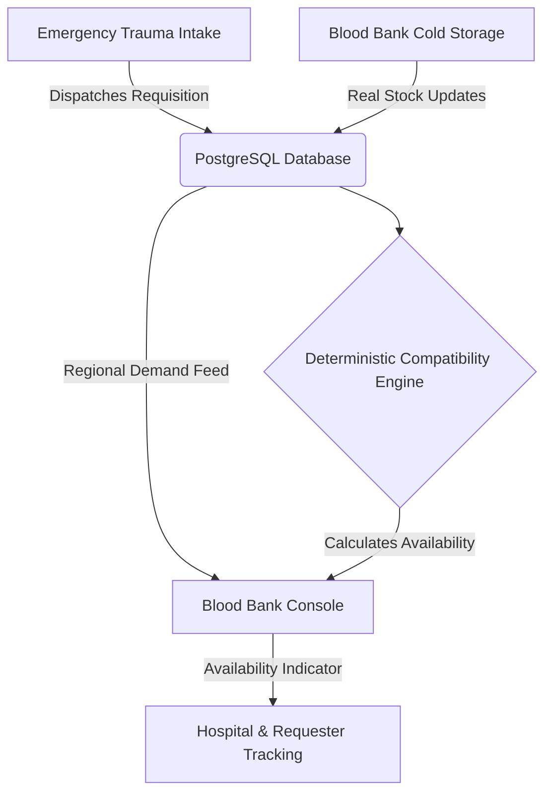

# LifeLink AI — Official Presentation Source of Truth (PPT.md)
## Comprehensive Technical & Architectural Blueprint (Phases 1.1 – 1.5)

> **Document Classification:** Official Team & Presentation Source of Truth  
> **Repository Target:** LifeLink AI (`d:\A\LifeLink_AI`)  
> **Current Version:** Phase 1.5 Complete  
> **Implementation Status:** Foundation Complete (~40–45% of Total Product Scope)  
> **Phase 1.6 Status:** **NOT STARTED** (Intentionally excluded from current implementation)  
> **Target Audience:** Project Supervisor, Technical Evaluators, Department Faculty, and Presentation Design Team  

---

## Important Rules for the Presentation Team

1. **Strict Fidelity to Implementation:** Present *only* features and data models that physically exist in the repository today.
2. **Clear Separation of Present vs. Future:** Do NOT describe planned machine learning models, predictive algorithms, automated SMS/FCM notifications, or live GPS telemetry as "currently working." Clearly delineate them under **Future Work / Phase 1.6+ Roadmap**.
3. **No Fabricated Metrics:** Do not claim real hospital deployments, simulated clinical trials, fake ML accuracy percentages (e.g., "99.4% F1-score"), or fabricated unit statistics. All data shown in the operational console is real PostgreSQL state.
4. **Use Exact Terminology:** Refer to components using their exact architectural definitions (e.g., *PostgreSQL 15 PostGIS*, *FastAPI Async Engine*, *Next.js 14 Standalone App Router*, *Pessimistic Row-Level Locking*, *Deterministic Immunohematology Matrix*, *ReBAC Tenancy Isolation*).

---

## Executive Project Summary

| Metric / Dimension | Verified Implementation State |
|:---|:---|
| **Platform Name** | **LifeLink AI** — Intelligent Emergency Blood Coordination Platform |
| **Current Implemented Scope** | **Phases 1.1, 1.2, 1.3, 1.4, 1.5 Completed & Verified** |
| **Next Phase** | **Phase 1.6 (AI Matching & Notification Dispatch) — NOT STARTED** |
| **Overall Progress** | **~40–45% of Total Product Roadmap** (Foundational & Operational Layer 100% Complete) |
| **Backend Test Suite** | **41 / 41 Tests Passing (100%)** via Pytest & AsyncPG (`tests/`) |
| **End-to-End Tests** | **10 / 10 Live HTTP Integration Scenarios Passing** (`test_phase15_e2e.py`) |
| **Infrastructure Stack** | 6 Docker Containers (`nginx`, `frontend`, `backend`, `ai-service`, `postgres`, `redis`) |
| **Database Migrations** | 5 Reversible Alembic Migrations applied (Head: `e7045182f6d4`) |
| **Supported Roles** | Donor, Hospital Administrator/Staff, Blood Bank Manager, Public Requester |

---

## Slide-by-Slide Presentation Blueprint (16 Slides)

```
================================================================================
SLIDE 1: TITLE & COVER
================================================================================
```

### Slide Title
**LifeLink AI**  
*AI-Powered Emergency Blood Coordination Platform*

### Slide Subtitle / Meta
- **Track:** Healthcare Technology / Distributed Distributed Systems / Applied AI
- **Project Type:** Final Year Major Technical Project / Advanced Engineering Capstone
- **Supervisor / Guide:** [Supervisor Name Placeholder, Designation, Department]
- **Team Members:** [Student Name 1 & Roll No], [Student Name 2 & Roll No], [Student Name 3 & Roll No]
- **Academic Institution:** [Department of Computer Science & Engineering / Institution Placeholder]
- **Repository Branch / Milestone:** `main` — Phase 1.5 Release Foundation

### Slide Visual / Layout Guidance
- Clean, clinical dual-tone cover slide (LifeLink Crimson `#DC2626` / Deep Navy `#0F172A` on clean slate).
- LifeLink Logo / Cross-Pulse emblem on the left, clear typography on the right.
- Visual badge: `Phase 1.5 Verified Architecture`.

### Speaker Notes (30–45 Seconds)
> "Good morning respected supervisor and faculty members. Today we are presenting **LifeLink AI**, an emergency blood coordination platform designed to eliminate critical delays in trauma blood supply chains. Over the past development cycle, we have completed the foundational architecture from Phase 1.1 through Phase 1.5, establishing a containerized, database-backed platform covering emergency request intake, donor management, hospital requisitions, blood bank operations, and real-time inventory availability with deterministic compatibility. Today we will walk you through the system architecture, our verified engineering accomplishments, and our live demonstration."

---

```
================================================================================
SLIDE 2: PROBLEM STATEMENT & MOTIVATION
================================================================================
```

### Slide Title
**The Problem: Critical Latency & Fragmentation in Emergency Blood Supply**

### Core Points
1. **The "Golden Hour" Trauma Window:**
   - In hemorrhagic shock, maternal trauma, and acute surgery, delays in procuring compatible blood directly impact survival rates.
2. **Fragmented Communication Channels:**
   - Hospital emergency rooms and desperate patient relatives rely on ad-hoc phone calls, broadcast messaging groups, and physical runners to locate rare blood units.
3. **Information Asymmetry & Zero Real-Time Stock Visibility:**
   - Blood banks and hospital blood storage operate in siloed environments with zero inter-facility visibility into regional emergency demand or cold-storage availability.
4. **Donor Fatigue & Coordination Bottlenecks:**
   - Voluntary donors are inundated with duplicate, unverified, or outdated requests across social media, leading to low response rates when genuine emergencies arise.
5. **Manual Matching Overhead:**
   - Clinical cross-matching verification is often performed manually under high stress without automated compatibility pre-filtering.

### Screenshot / Visual Guidance
- Diagram contrasting:
  - *Current Reality:* Patient Family $
ightarrow$ Fragmented Phone Calls / Social Media $
ightarrow$ Stockout / Delays.
  - *LifeLink AI Approach:* Single Emergency Intake $
ightarrow$ Deterministic Compatibility Check $
ightarrow$ Real-Time Facility Availability $
ightarrow$ Coordinated Dispatch.

### Speaker Notes (45–60 Seconds)
> "In acute emergencies, locating compatible blood is often a chaotic, fragmented race against time. Families and hospital staff make dozens of uncoordinated phone calls to regional blood banks while patient condition deteriorates. The core engineering problem is information asymmetry: blood banks cannot see real-time trauma demand, hospitals cannot query verified regional stock dynamically, and voluntary donors receive unvetted alerts. LifeLink AI was engineered to replace this manual friction with a centralized, automated coordination network that connects requesters, hospitals, blood banks, and donors with strict data integrity."

---

```
================================================================================
SLIDE 3: PROPOSED SOLUTION & PLATFORM WORKFLOW
================================================================================
```

### Slide Title
**The Proposed Solution: Unified Coordination Platform**

### Solution Architecture Breakdown
- **Instant Emergency Request Intake:** Rapid public and hospital-grade dispatch interface capturing patient blood group, units required, urgency level, and clinical destination.
- **Role-Based Institutional Portals:** Dedicated operational consoles for Hospital trauma centers and Blood Bank cold-storage facilities.
- **PostgreSQL-Backed Real-Time Inventory:** Physical blood stock tracking across 8 ABO/Rh blood groups with batch shelf-life and buffer threshold alerts.
- **Deterministic Immunohematology Engine:** Rule-based compatibility calculations for Whole Blood, Packed Red Blood Cells (PRBC), and Plasma (FFP).
- **Zero-PII Public Tracking:** DPDP-aligned tracking portals providing real-time fulfillment status without exposing sensitive patient health information.

### Platform Coordination Diagram


### Speaker Notes (45–60 Seconds)
> "Our solution, LifeLink AI, provides an end-to-end digital pipeline. When an emergency requisition is dispatched, the system immediately records the demand in PostgreSQL. The deterministic medical engine evaluates the requirement against active blood bank inventories in the municipality, accounting for ABO/Rh compatibility rules and shelf-life expiration. Blood banks immediately see regional emergency demand with automated availability indicators—identifying exact matches and universal substitutes—allowing rapid operational decision-making."

---

```
================================================================================
SLIDE 4: SYSTEM USERS & ROLE ARCHITECTURE (ReBAC)
================================================================================
```

### Slide Title
**Multi-Tenant Stakeholders & Role-Based Access Control**

### Supported User Personas (Implemented in Repository)

| Persona / Role | Target User | Key Capabilities in Current Implementation | Auth & ReBAC Enforcement |
|:---|:---|:---|:---|
| **Public Requester** | Patient relative / Citizen | - Submit public emergency blood request<br>- Track dispatch status via sanitized token URL | Unauthenticated or Basic User; strict PII masking |
| **Voluntary Donor** | Registered blood donor | - Manage donor profile (weight, eligibility, last donation)<br>- Toggle real-time donation availability | `role: DONOR`; JWT verified; cannot mutate facility stock |
| **Hospital Staff / Admin** | Trauma Center / Surgeon | - Register verified hospital facility<br>- Dispatch clinical emergency requisitions<br>- Manage institutional requisitions log | `role: HOSPITAL_ADMIN`; ReBAC verification against `hospitals` table |
| **Blood Bank Manager** | Blood Bank Director | - Manage cold chain inventory (units, buffer, expiry)<br>- View regional emergency demand feed<br>- View live compatibility & availability status | `role: BLOOD_BANK_MANAGER`; ReBAC verified against `blood_banks` table |

### Security & Tenancy Isolation
- Strict **Relationship-Based Access Control (ReBAC)**: A manager of Blood Bank A cannot inspect or modify inventory belonging to Blood Bank B (enforced by `_get_my_blood_bank_id` database queries).
- Hospital users are strictly prevented from directly modifying blood bank inventories.

### Speaker Notes (45–60 Seconds)
> "LifeLink AI is built around four primary stakeholders, each with distinct operational boundaries. Donors manage their health profile and readiness toggle. Hospital administrators can register their facility and dispatch emergency requisitions. Blood bank managers oversee physical cold chain stock and regional trauma demand. Security is enforced through strict Relationship-Based Access Control: users can only access facilities they officially manage, preventing cross-tenant data tampering."

---

```
================================================================================
SLIDE 5: SYSTEM ARCHITECTURE & MICROSERVICES
================================================================================
```

### Slide Title
**System Architecture & Containerized Topology**

### Architectural Diagram
```
                           ┌───────────────────────────────┐
                           │      Client Web Browsers      │
                           │   (Desktop, Tablet, Mobile)   │
                           └───────────────┬───────────────┘
                                           │ HTTP / WebSocket (:80, :443)
                                           ▼
                           ┌───────────────────────────────┐
                           │      Nginx Reverse Proxy      │
                           │     (SSL / Routing / Logs)    │
                           └───────┬───────────────┬───────┘
                                   │               │
            /api/v1/ (Backend API) │               │ / (Next.js SSR/Static)
                                   ▼               ▼
           ┌───────────────────────────────┐   ┌───────────────────────────────┐
           │      FastAPI Backend API      │   │     Next.js 14 Frontend       │
           │      (Python 3.11 / Async)    │   │     (React / Tailwind CSS)    │
           └───────┬───────────────┬───────┘   └───────────────────────────────┘
                   │               │
                   │               │ HTTP IPC (:8001)
                   │               ▼
                   │   ┌───────────────────────────────┐
                   │   │       FastAPI AI Service      │
                   │   │     (Python 3.11 / Scaffolding)│
                   │   └───────────────────────────────┘
                   │
    ┌──────────────┴──────────────┐
    ▼                             ▼
┌─────────────────────────┐   ┌─────────────────────────┐
│  PostgreSQL 15 PostGIS  │   │     Redis 7 (Alpine)    │
│  (Relational / Spatial) │   │  (Rate Limiting/Cache)  │
└─────────────────────────┘   └─────────────────────────┘
```

### Component Responsibilities
1. **Nginx (Port 80/443):** Reverse proxy handling static asset caching, request ID injection, rate limiting, and path routing (`/api/*` $
ightarrow$ Backend, `/*` $
ightarrow$ Frontend).
2. **Next.js 14 Frontend:** React-based standalone application providing responsive UI, SSR/Static generation, and Light/Dark theme switching.
3. **FastAPI Backend (Port 8000):** Async Python engine handling business logic, ReBAC authorization, database ORM, and deterministic compatibility.
4. **PostgreSQL 15 + PostGIS (Port 5432):** Relational persistence, spatial coordinates, row-level pessimistic locking, and foreign key integrity.
5. **Redis 7 (Port 6379):** High-speed in-memory store for rate limiting and session tokens.
6. **FastAPI AI Service (Port 8001):** Microservice dedicated to future ML matching models (currently running foundation health & compatibility checks).

### Speaker Notes (45–60 Seconds)
> "Here we see our containerized microservice topology orchestrated via Docker Compose. Incoming client traffic enters through Nginx, which routes frontend requests to Next.js 14 and API requests to our asynchronous FastAPI backend. The backend interfaces with PostgreSQL 15 for ACID-compliant persistence and Redis for high-speed rate limiting. A dedicated AI microservice is containerized and connected via internal bridge network, ready for future machine learning model integration. All six services run isolated with automated health checks."

---

```
================================================================================
SLIDE 6: PHASE 1.1 — INFRASTRUCTURE & RUNTIME FOUNDATION
================================================================================
```

### Slide Title
**Phase 1.1: Containerized Infrastructure & Developer Workflow**

### Technical Accomplishments
- **Multi-Container Docker Architecture:** Defined and orchestrated 6 services in `docker-compose.yml` with health checks and restart policies.
- **Database Persistence & Storage Isolation:** Configured persistent Docker volumes ensuring database storage and migrations remain intact across container restarts.
- **Development Lifecycle Automation (`run.bat` & `stop.bat`):**
  - `run.bat`: Launches the entire Docker stack, monitors container health checks, opens dedicated live log streaming consoles for Frontend, Backend, and AI Service, and opens the default browser at `http://localhost`.
  - `stop.bat`: Executes `scripts/close_lifelink_windows.ps1` to gracefully terminate only LifeLink-spawned terminals using process title and PID tracking, strictly preserving unrelated developer CMD and PowerShell windows.
- **Alembic Database Migration Pipeline:** Configured async SQLAlchemy migration environment with automated `upgrade head` and `downgrade` workflows.

### Screenshot Guidance
- **Suggested Screenshot:** Terminal window showing all 6 Docker containers in `healthy` state (`docker compose ps`) alongside the persistent LifeLink Launcher.
- **Caption:** *"Phase 1.1 Verified Runtime: Multi-service container stack with automated health checking and isolated developer log management."*

### Speaker Notes (30–45 Seconds)
> "Phase 1.1 focused on building an enterprise-grade developer and operational runtime. We engineered a multi-stage Docker environment with automated health checks across all six services. To support robust daily development, we created custom PowerShell lifecycle scripts that launch and monitor dedicated service log windows and ensure clean, non-destructive shutdown without interfering with unrelated developer terminals."

---

```
================================================================================
SLIDE 7: PHASE 1.2 — PRODUCT UI & HEALTHCARE DESIGN SYSTEM
================================================================================
```

### Slide Title
**Phase 1.2: Design System & Emergency Request Intake**

### Technical Accomplishments
- **Dual Light/Dark Semantic Design System:**
  - Implemented comprehensive CSS variables and Tailwind tokens in `frontend/styles/globals.css` and `tailwind.config.js`.
  - Balanced clinical palette: LifeLink Crimson (`#DC2626`), Warning Amber (`#D97706`), Success Green (`#16A34A`), and Information Blue (`#2563EB`).
  - Zero oppressive pitch-black or decorative red overload; fully compliant with WCAG 2.1 AA contrast requirements.
- **Accessible UI Component Suite:** Built accessible, modular components (`Button`, `Card`, `Badge`, `Input`, `Modal`, `ThemeToggle`) with keyboard navigation and ARIA dialog traps.
- **Public Emergency Intake & Tracking:**
  - Emergency intake interface (`/emergency`) capturing blood group, units, urgency, and facility destination.
  - Public dispatch tracking (`/emergency/track/[id]`) rendering live request status with complete sanitization of patient health information (PHI).
- **Responsive Landing Page (`/`):** Dynamic hero section, interactive 8-group blood compatibility preview, institutional overview, and collapsible developer diagnostics.

### Screenshot Guidance
- **Suggested Screenshot:** Side-by-side comparison of the LifeLink AI Landing Page in **Light Theme** and **Dark Theme**.
- **Caption:** *"Phase 1.2 Dual-Theme Healthcare Design System: Responsive emergency intake and accessible clinical UI components."*

### Speaker Notes (45–60 Seconds)
> "In Phase 1.2, we transitioned the frontend from a development prototype into a polished, accessible healthcare design system. We established semantic design tokens supporting seamless Light and Dark modes. We implemented our public emergency intake form and a sanitized public tracking page. Crucially, in accordance with data privacy best practices and DPDP guidelines, public tracking links display operational status while strictly concealing patient name, age, and internal clinical notes."

---

```
================================================================================
SLIDE 8: PHASE 1.3 — AUTHENTICATION & DONOR FOUNDATION
================================================================================
```

### Slide Title
**Phase 1.3: Identity, Authentication & Donor Management**

### Technical Accomplishments
- **Stateless JWT Authentication:**
  - Secure password hashing with PBKDF2-SHA256 (`passlib`).
  - HMAC-SHA256 access tokens with expiration handling and Bearer token dependency injection.
  - Endpoints: `POST /api/v1/auth/register`, `POST /api/v1/auth/login`, `GET /api/v1/auth/me`, `POST /api/v1/auth/logout`.
- **Role-Based Authorization Framework:**
  - Fast-path role verification supporting `SUPER_ADMIN`, `HOSPITAL_ADMIN`, `BLOOD_BANK_MANAGER`, `DONOR`, `PATIENT`.
- **Donor Profile Management (`/donor`):**
  - Database table `donors` linked via foreign key to `users.id`.
  - Clinical validation rules: donor weight validation ($\ge 45	ext{ kg}$), date of birth, blood type, and total donation count.
  - Real-time availability toggling (`PATCH /api/v1/donors/me/availability`) allowing voluntary donors to control their emergency dispatch readiness.
- **Role-Aware Navigation:** Dynamic top navbar automatically adjusting navigation links between Donor, Hospital, Blood Bank, and Unauthenticated states.

### Screenshot Guidance
- **Suggested Screenshot:** Donor Dashboard (`/donor`) showing donor readiness status, eligibility details, and donation history.
- **Caption:** *"Phase 1.3 Donor Management: Profile management, health eligibility verification, and instant availability toggling."*

### Speaker Notes (45–60 Seconds)
> "Phase 1.3 delivered our security and donor foundation. We implemented stateless JWT authentication with encrypted password hashing and granular role enforcement. On top of this, we built the voluntary donor module: donors can manage their medical eligibility parameters—such as mandatory 45-kilogram minimum weight thresholds—and toggle their real-time donation availability. The global navigation bar was made role-aware, providing authenticated users with immediate access to their specific dashboard."

---

```
================================================================================
SLIDE 9: PHASE 1.4 — HOSPITAL & BLOOD BANK OPERATIONAL FOUNDATION
================================================================================
```

### Slide Title
**Phase 1.4: Hospital & Blood Bank Institutional Portals**

### Technical Accomplishments
- **Hospital Institutional Portal (`/hospital`, `/hospital/profile`, `/hospital/requests`):**
  - Institutional registration with statutory licensing numbers and inpatient bed capacity.
  - Clinical emergency requisition dispatch modal (`POST /api/v1/hospitals/me/requests`) binding requests to the hospital facility.
  - Filterable hospital requisitions log (`/hospital/requests`) tracking status from `PENDING` to `FULFILLED`.
  - ReBAC authorization ensuring hospital users can only manage their own requisitions.
- **Blood Bank Operational Console (`/blood-bank`, `/blood-bank/profile`):**
  - Registration with drug controller licensing, 24/7 service indicators, and walk-in donation policies.
  - Regional Emergency Blood Demand Feed: Real-time visibility into active trauma requisitions originating from hospitals within the blood bank's municipality.
- **Database Schema Migration (`d6934071e5c3`):**
  - Created `hospitals`, `hospital_staff`, and `blood_banks` tables with foreign keys linking `emergency_requests` to `hospitals.id` and `users.id`.

### Screenshot Guidance
- **Suggested Screenshot:** Hospital Dashboard showing active requisitions alongside the Blood Bank Console displaying the regional emergency demand feed.
- **Caption:** *"Phase 1.4 Institutional Portals: Hospital requisition dispatch and municipal blood bank emergency demand feed."*

### Speaker Notes (45–60 Seconds)
> "Phase 1.4 established the operational backbone for institutions. Hospitals can register their facility, manage staff associations, and dispatch official trauma requisitions with full audit trails. Concurrently, blood banks gained access to their operational console, giving them live visibility into emergency requisitions across their municipality. This bidirectional relationship established the necessary institutional channels for our next major milestone: real-time cold-chain inventory."

---

```
================================================================================
SLIDE 10: PHASE 1.5 — REAL BLOOD INVENTORY SYSTEM
================================================================================
```

### Slide Title
**Phase 1.5: Real PostgreSQL-Backed Blood Inventory**

### Technical Accomplishments
- **Transition from Placeholder to Real PostgreSQL Storage:**
  - Replaced the Phase 1.4 placeholder with physical stock tracking across all 8 ABO/Rh blood groups.
  - Supported component categories: `WHOLE_BLOOD`, `RBC` (Packed Red Cells), `PLASMA` (FFP), `PLATELETS`, `CRYOPRECIPITATE`.
- **Database Schema & Audit Ledger (Migration `e7045182f6d4`):**
  - `blood_inventory` table: Stores `units_available`, `units_reserved`, `minimum_threshold`, `last_restocked_at`, and earliest `expiry_date`.
  - Database Constraints: Non-negative checks (`units_available >= 0`, `units_reserved >= 0`, `units_reserved <= units_available`) and composite unique key `(facility_type, facility_id, blood_type, component)`.
  - `inventory_history` table: Immutable audit ledger recording `units_before`, `units_after`, `units_delta`, user ID, timestamp, and modification reason.
- **ADR-001 Concurrency Protection:**
  - Employs PostgreSQL pessimistic row-level locking (`SELECT ... FOR UPDATE`) during stock updates to prevent race conditions and over-allocation.
- **Expiration Enforcement:**
  - Units with `expiry_date < date.today()` are automatically flagged as expired and **strictly excluded** from net available stock counts.

### Screenshot Guidance
- **Suggested Screenshot:** Blood Bank Inventory Management Table on `/blood-bank` showing the 8 blood groups, stock levels, status badges, and the stock adjustment modal.
- **Caption:** *"Phase 1.5 Real Cold-Chain Inventory: PostgreSQL-backed stock management with pessimistic row locking and shelf-life tracking."*

### Speaker Notes (60 Seconds)
> "Phase 1.5 represents a major milestone: transitioning our blood bank console into a real PostgreSQL-backed cold storage inventory management system. We implemented the aggregated stock model defined in DATABASE.md along with an immutable audit history ledger. Concurrency safety is guaranteed via pessimistic row-level locking, preventing simultaneous allocations from causing negative stock. Batch shelf life is strictly enforced: units that cross their expiration date are automatically quarantined and omitted from available stock calculations. Every quantity displayed on the console reflects real database state."

---

```
================================================================================
SLIDE 11: DETERMINISTIC COMPATIBILITY & AVAILABILITY ENGINE
================================================================================
```

### Slide Title
**Deterministic Immunohematology Compatibility & Availability**

### Technical Implementation (`backend/app/core/medical.py`)
- **Deterministic Standard-Library Engine:**
  - Pure Python, zero-dependency medical rule engine executing O(1) set-membership compatibility checks.
  - **Important Clarification:** Compatibility is strictly rule-based based on immunohematology standards—it is NOT an ML inference model.
- **Red Blood Cell / Whole Blood Compatibility Matrix:**
  - Recipient `O-` $
ightarrow$ Compatible with `O-` only *(Universal RBC Donor)*
  - Recipient `O+` $
ightarrow$ Compatible with `O-`, `O+`
  - Recipient `A-` $
ightarrow$ Compatible with `O-`, `A-`
  - Recipient `A+` $
ightarrow$ Compatible with `O-`, `O+`, `A-`, `A+`
  - Recipient `B-` $
ightarrow$ Compatible with `O-`, `B-`
  - Recipient `B+` $
ightarrow$ Compatible with `O-`, `O+`, `B-`, `B+`
  - Recipient `AB-` $
ightarrow$ Compatible with `O-`, `A-`, `B-`, `AB-`
  - Recipient `AB+` $
ightarrow$ Compatible with All 8 Blood Groups *(Universal RBC Recipient)*
- **Fresh Frozen Plasma (FFP) Inverted Compatibility:**
  - Correctly models inverted antibody compatibility: `AB` is the universal plasma donor; `O` is the universal plasma recipient.
- **Real-Time Availability Evaluation (`/me/demand/{id}/availability`):**
  - Dynamically evaluates on-hand cold storage against incoming emergency requisitions.
  - Categorizes status: 🟢 **AVAILABLE** (compatible units $\ge$ required), 🟡 **PARTIAL** (units $> 0$ but $<$ required), 🔴 **UNAVAILABLE** (0 compatible units).
  - Identifies exact matches and universal substitutes while excluding incompatible groups and expired stock.

### Speaker Notes (60 Seconds)
> "To connect inventory with trauma demand, we implemented our deterministic medical compatibility engine in backend/app/core/medical.py. We want to emphasize that this is a rule-based, immunohematology-grounded algorithm—not a machine learning model. For red blood cells, it recognizes O- as universal donor and AB+ as universal recipient, while also correctly supporting inverted plasma compatibility where AB is universal. When a blood bank views regional demand, the system dynamically checks on-hand stock and displays clear visual indicators: confirming whether compatible stock is available, partial, or unavailable, with full breakdown of exact matches and universal substitutes."

---

```
================================================================================
SLIDE 12: DATA PRIVACY & SECURITY ARCHITECTURE
================================================================================
```

### Slide Title
**Security Architecture & Privacy-by-Design**

### Security Controls Matrix

| Security Dimension | Implemented Mechanism in LifeLink AI | Verification / Evidence |
|:---|:---|:---|
| **Authentication** | Stateless JWT tokens (HMAC-SHA256) + PBKDF2-SHA256 password hashing | Unauthenticated requests to protected endpoints return `401 Unauthorized`. |
| **Multi-Tenancy (ReBAC)** | Facility ownership validation via `manager_user_id` / `hospital_staff` queries | Blood Bank A manager attempting to access Blood Bank B data receives `404 Not Found`. |
| **Data Privacy (DPDP)** | Sanitized serialization schemas (`EmergencyPublicTrackingSchema`) | Public tracking endpoints completely omit `patient_name`, `patient_age`, and clinical `notes`. |
| **Concurrency Safety** | PostgreSQL row-level locks (`SELECT ... FOR UPDATE`) | Prevents double allocation and negative stock in concurrent emergency requests. |
| **Input Validation** | Pydantic v2 strict schema validators | Rejects invalid blood groups (e.g. `Z+`), negative units, and malformed dates with `422`. |
| **Audit Ledger** | Immutable `inventory_history` table | Every stock modification records user ID, timestamp, before/after units, and reason. |

### Speaker Notes (45 Seconds)
> "Security and privacy are engineered directly into the foundational layer. We enforce strict multi-tenant isolation through ReBAC queries so no facility can inspect or tamper with another's data. In compliance with data privacy principles and DPDP guidelines, our public tracking and regional demand feeds utilize sanitized projection schemas that expose operational details while stripping all patient identifiers. Database-level constraints and pessimistic row locks safeguard data integrity against concurrent modifications."

---

```
================================================================================
SLIDE 13: FRONTEND USER EXPERIENCE & ROUTING STRUCTURE
================================================================================
```

### Slide Title
**Frontend Architecture & Implemented Routes**

### Route Map (Verified in Repository)

```
frontend/app/
├── (public)
│   ├── /                          # Main Landing Page & Emergency Quick-Intake
│   ├── /emergency                 # Comprehensive Emergency Requisition Form
│   ├── /emergency/track/[id]      # Sanitized Public Dispatch Tracking Portal
│   ├── /login                     # User Authentication & Role Redirect
│   └── /register                  # Multi-Role User Registration
└── (dashboard)
    ├── /dashboard                 # General Account Overview
    ├── /donor                     # Donor Profile, Medical Eligibility & Readiness Toggle
    ├── /hospital                  # Hospital Operations Console & Quick Dispatch
    ├── /hospital/profile          # Hospital Institutional Licensing & Capacity Settings
    ├── /hospital/requests         # Hospital Emergency Requisitions Management Log
    ├── /blood-bank                # Blood Bank Cold Storage Console & Emergency Demand Feed
    └── /blood-bank/profile        # Blood Bank Licensing, Hours & Donation Policies
```

### UI/UX Design Highlights
- **Role-Aware Adaptive Navbar:** Displays context-specific navigation links based on active JWT claims.
- **Dual Light/Dark Theme Support:** Persistent theme toggle with zero flash of unstyled content (FOUC).
- **Responsive Layout:** CSS Grid & Flexbox breakpoints optimized across mobile, tablet, and widescreen displays.

### Speaker Notes (30–45 Seconds)
> "The frontend is built on Next.js 14 App Router, organizing routes cleanly between public intake pages and authenticated dashboard portals. All 12 primary application routes are fully implemented and verified. The user experience is responsive, accessible, and provides role-aware navigation that dynamically adapts whether a user is an unauthenticated citizen, a voluntary donor, a hospital surgeon, or a blood bank manager."

---

```
================================================================================
SLIDE 14: TESTING & VERIFICATION METRICS
================================================================================
```

### Slide Title
**Verification Matrix: 100% Automated Test Pass Rate**

### Concrete Test Results (Verified Against Live Codebase)

| Verification Category | Tool / Framework | Scope / Scenarios Tested | Result |
|:---|:---|:---|:---:|
| **Backend Test Suite** | Pytest + AsyncPG + HTTPX | 41 unit & integration tests covering Auth (6), Blood Bank (6), Donor (7), Emergency (5), Health (1), Hospital (6), Inventory (10) | **41 / 41 PASSED** (25.13s) |
| **Live E2E Integration** | Python HTTP Client (`test_phase15_e2e.py`) | 10-step full workflow (Hospital registration $
ightarrow$ Blood Bank inventory $
ightarrow$ Emergency dispatch $
ightarrow$ Demand feed $
ightarrow$ Compatibility check $
ightarrow$ ReBAC isolation $
ightarrow$ Privacy sanitization) | **10 / 10 PASSED** |
| **Frontend Production Build** | Next.js 14 Webpack/Turbopack | 14 static and dynamic routes compiled in standalone production mode | **COMPILED (0 Errors)** |
| **HTTP Route Verification** | HTTP Crawler (`verify_phase14.py`) | 13 primary application and API routes tested over HTTP Port 80 | **13 / 13 HTTP 200 OK** |
| **Terminal Isolation Test** | PowerShell (`test_full_isolation.py`) | Targeted lifecycle process termination preserving unrelated user terminals | **PASSED** |
| **Container Health** | Docker Compose | Automated health checks across all 6 services (`postgres`, `redis`, `backend`, `ai-service`, `frontend`, `nginx`) | **6 / 6 HEALTHY** |

### Speaker Notes (45 Seconds)
> "Every capability presented today is backed by automated tests. Our backend test suite contains 41 asynchronous pytest test cases covering authentication, donor eligibility, emergency lifecycle, hospital operations, inventory constraints, and compatibility algorithms—all executing with 100% pass rate. Furthermore, our live end-to-end integration test verifies the complete cross-role workflow against the running Docker stack through our Nginx gateway, proving robust system integration."

---

```
================================================================================
SLIDE 15: CURRENT SYSTEM CAPABILITIES
================================================================================
```

### Slide Title
**Capability Matrix: Implemented vs. Planned**

### Project Progress Breakdown (~40–45% Total Scope)

| Capability / Module | Current Implementation Status | Underlying Technology |
|:---|:---:|:---|
| **Containerized Infrastructure** | **COMPLETED (Phase 1.1)** | Docker Compose, Nginx, PostgreSQL, Redis |
| **Healthcare Design System & UI** | **COMPLETED (Phase 1.2)** | Next.js 14, Tailwind CSS, Light/Dark Tokens |
| **Public Emergency Intake & Tracking** | **COMPLETED (Phase 1.2)** | FastAPI, Pydantic v2, Sanitized Schemas |
| **JWT Auth & Role Enforcement** | **COMPLETED (Phase 1.3)** | Passlib (PBKDF2), Python-JOSE (HMAC-SHA256) |
| **Donor Profile & Readiness Toggle** | **COMPLETED (Phase 1.3)** | AsyncPG, SQLAlchemy 2.0, Zustand Store |
| **Hospital Operations Portal** | **COMPLETED (Phase 1.4)** | FastAPI ReBAC, Next.js App Router |
| **Blood Bank Operational Console** | **COMPLETED (Phase 1.4)** | Municipal Demand Feed, Status Management |
| **Real PostgreSQL Blood Inventory** | **COMPLETED (Phase 1.5)** | `blood_inventory`, Pessimistic Row Locking |
| **Immutable Inventory Audit Ledger** | **COMPLETED (Phase 1.5)** | `inventory_history`, Foreign Key Constraints |
| **Deterministic Compatibility Engine**| **COMPLETED (Phase 1.5)** | `app.core.medical`, ABO/Rh Matrix |
| **Demand Availability Analysis** | **COMPLETED (Phase 1.5)** | Real-Time Stock Availability Indicator |
| **AI/ML Donor Ranking & Matching** | **NOT STARTED (Planned Phase 1.6+)**| *Future ML Service / XGBoost / PyTorch* |
| **Automated SMS / Push Notifications**| **NOT STARTED (Planned Phase 1.6+)**| *Future Firebase Cloud Messaging / Twilio* |
| **Live GPS Telemetry & Tracking** | **NOT STARTED (Planned Future)** | *Future WebSocket / Telemetry Gateway* |
| **Predictive Blood Demand Forecasting**| **NOT STARTED (Planned Future)** | *Future Time-Series Forecasting Models* |

### Speaker Notes (45 Seconds)
> "This capability matrix provides an honest, clear assessment of our progress. The foundational and operational layers—accounting for approximately 40 to 45% of our total architectural vision—are completely implemented, database-backed, and verified. The remaining phases will build directly upon this solid operational foundation to introduce intelligent AI ranking, automated notification dispatch, and predictive analytics."

---

```
================================================================================
SLIDE 16: FUTURE WORK & PHASE 1.6+ ROADMAP
================================================================================
```

### Slide Title
**Future Work & Engineering Roadmap**

### Roadmap Milestones

```
┌────────────────────────────────────────────────────────────────────────┐
│                        COMPLETED FOUNDATION                            │
├────────────────────────────────────────────────────────────────────────┤
│  Phase 1.1: Docker Infrastructure & Runtime Pipeline                   │
│  Phase 1.2: Design System & Public Emergency Intake                   │
│  Phase 1.3: JWT Authentication & Voluntary Donor Module               │
│  Phase 1.4: Hospital Requisitions & Blood Bank Operational Portals    │
│  Phase 1.5: PostgreSQL Blood Inventory & Deterministic Compatibility  │
└───────────────────────────────────┬────────────────────────────────────┘
                                    │
                                    ▼
┌────────────────────────────────────────────────────────────────────────┐
│                         PLANNED FUTURE PHASES                          │
├────────────────────────────────────────────────────────────────────────┤
│  Phase 1.6 (NOT STARTED): AI Donor Matching & Multi-Channel Dispatch   │
│   • ML-based donor ranking algorithms (distance, eligibility, response)│
│   • Automated emergency notification dispatch (Firebase / SMS)         │
│   • Donor acceptance and commitment workflow                           │
│                                                                        │
│  Phase 2: Individual Blood Bag Serialization & Barcode Scanning        │
│   • Bag-level DIN / ISBT-128 tracking and cold-storage rack telemetry  │
│   • Automated stock deduction upon clinical fulfillment                │
│                                                                        │
│  Phase 3: Real-Time Telemetry & Predictive Analytics                   │
│   • Live transit routing and ambulance telemetry                       │
│   • Municipal blood shortage forecasting using time-series models      │
└────────────────────────────────────────────────────────────────────────┘
```

### Final Conclusion
> *"LifeLink AI has successfully progressed from an infrastructure prototype into a functional, database-backed emergency blood coordination platform. Through Phase 1.5, the platform delivers authenticated multi-tenant workflows, hospital requisitions, blood bank operations, physical inventory management, and deterministic compatibility analysis. The next phase will activate intelligent AI-driven donor matching and automated notification dispatch."*

### Speaker Notes (45–60 Seconds)
> "In conclusion, we have established a reliable, containerized foundation that solves the critical problem of inter-facility visibility and real-time inventory tracking. Phase 1.6, which has not yet been started, will focus on building the machine learning ranking model to match voluntary donors based on proximity and historical availability, coupled with automated push notifications. Thank you, and we are now ready to demonstrate the live platform and answer your questions."

---

## Live Demonstration Script (15-Step Walkthrough)

Follow this sequence for a live presentation:

1. **Service Health Check:** Show terminal executing `docker compose ps` verifying 6 healthy containers.
2. **Landing Page (`http://localhost`):** Display responsive landing page with healthcare design system and developer diagnostics.
3. **Theme Switching:** Click the theme toggle to demonstrate instant, anti-FOUC switching between Light and Dark modes.
4. **Public Emergency Intake:** Navigate to `/emergency` and show form validation (blood type, units required, urgency, city, hospital).
5. **Public Tracking & Privacy:** Open the generated tracking link (`/emergency/track/[id]`) and highlight that operational status is visible while patient name, age, and clinical notes are hidden.
6. **User Registration & Login:** Register and log in as a **Hospital Administrator** (`HOSPITAL_ADMIN`).
7. **Hospital Portal (`/hospital`):** Demonstrate hospital facility dashboard, inpatient bed capacity, and requisition controls.
8. **Dispatch Hospital Requisition:** Open the modal, create an emergency requisition for **8 units of A+ blood** at "Manipal Trauma Center", and observe it appear in the requisitions log (`/hospital/requests`).
9. **Log Out & Switch Role:** Log in as a **Blood Bank Manager** (`BLOOD_BANK_MANAGER`).
10. **Blood Bank Console (`/blood-bank`):** Show the 4 cold storage KPI cards and observe the hospital's trauma request appearing in the **Regional Emergency Blood Demand Feed**.
11. **Cold Chain Inventory Management:** Scroll to the 8-group inventory table showing live PostgreSQL stock counts.
12. **Perform Stock Adjustment:** Click `Adjust Stock` for `O-` and `A+`, update quantities (e.g., 5 units of O- and 6 units of A+), set buffer threshold and expiry date, and submit.
13. **Live Compatibility & Availability Indicator:** Highlight the regional demand row for the A+ request: show the badge dynamically update to 🟢 **Compatible Stock Available (11 units)** with breakdown showing `Exact A+: 6` and `Universal O-: 5`.
14. **Test Donor Portal (`/donor`):** Log in as a registered **Donor** and show donor profile metrics, eligibility validation ($\ge 45	ext{ kg}$), and the instant availability toggle.
15. **Automated Test Suite Demonstration:** Run `docker compose exec -T backend pytest -v tests/ --no-cov` in the terminal to show **41/41 passing tests in under 26 seconds**.

---

## "DO NOT CLAIM" — Presentation Guardrails for Team Members

To ensure 100% academic integrity and prevent accidental exaggeration during faculty review, team members **MUST NOT** claim any of the following:

- ❌ **DO NOT CLAIM** that machine learning matching or AI ranking is currently running in production. *(Truth: The AI service container is operational, but ML donor ranking is scheduled for Phase 1.6. Current compatibility matching is deterministic and rule-based in `backend/app/core/medical.py`.)*
- ❌ **DO NOT CLAIM** any specific ML model accuracy (e.g., "98.5% precision", "trained on 50,000 records"). *(Truth: No custom neural network or gradient boosted tree has been trained yet.)*
- ❌ **DO NOT CLAIM** that automated SMS, WhatsApp, or Firebase push notifications are currently being dispatched to real phones. *(Truth: Notification dispatch infrastructure is planned for Phase 1.6.)*
- ❌ **DO NOT CLAIM** that live GPS driver tracking or real-time map route deviation is functional. *(Truth: Spatial queries use PostGIS coordinates; real-time GPS telemetry is planned for Phase 3.)*
- ❌ **DO NOT CLAIM** that real hospital databases or live blood bank inventories are currently connected. *(Truth: The system operates on real PostgreSQL database transactions, populated through platform forms and test suites.)*
- ❌ **DO NOT CLAIM** that Phase 1.6 has been started or completed. *(Truth: Phase 1.6 has NOT been started.)*

---

## 20 Likely Supervisor Questions & Project-Grounded Answers

### 1. Why did you choose PostgreSQL over MongoDB or other NoSQL databases?
> **Answer:** "Emergency blood management requires strict ACID transactional guarantees. Operations like reserving blood units, tracking finite cold-storage stock, and managing immutable audit history ledgers cannot tolerate eventual consistency or lost updates. PostgreSQL 15 provides robust check constraints, unique composite keys, pessimistic row-level locking (`SELECT ... FOR UPDATE`), and native spatial querying via PostGIS."

### 2. Why is Docker Compose used instead of running services locally?
> **Answer:** "Docker guarantees reproducible environments across different development and deployment machines. It isolates our 6 microservices—Nginx, Next.js, FastAPI, the AI microservice, PostgreSQL, and Redis—ensuring exact dependency versions and network topology without host-level conflicts."

### 3. What is the role of Redis in the current architecture?
> **Answer:** "Redis 7 functions as a high-speed in-memory store primarily utilized for API rate limiting (`RateLimitMiddleware`) and token revocation, protecting emergency endpoints from denial-of-service attempts."

### 4. Why did you select FastAPI for the backend instead of Django or Node.js/Express?
> **Answer:** "FastAPI offers native asynchronous I/O (`async`/`await`) with high concurrency performance, automatic OpenAPI documentation, and strict type validation via Pydantic v2. In emergency systems where latency is critical, async Python delivers superior throughput compared to synchronous WSGI frameworks."

### 5. Why Next.js 14 for the frontend?
> **Answer:** "Next.js 14 with the App Router enables a hybrid rendering model—static generation for informational and landing pages, and dynamic client-side rendering for real-time operational dashboards—combined with TypeScript for complete end-to-end type safety."

### 6. How is user authentication implemented?
> **Answer:** "Authentication is stateless, utilizing JSON Web Tokens (JWT) signed with HMAC-SHA256. Passwords are salted and hashed using PBKDF2-SHA256 via Passlib. Tokens contain user ID and role claims, which are verified on every request through FastAPI dependency injection (`get_current_active_user`)."

### 7. How do you prevent unauthorized users from mutating blood bank or hospital data?
> **Answer:** "We implement Relationship-Based Access Control (ReBAC). Beyond verifying the user's role claim, our database repositories execute ownership verification queries (`_get_my_blood_bank_id`), ensuring the user's ID matches the `manager_user_id` or `created_by` column of the facility. Unaffiliated callers receive HTTP 404/403."

### 8. How does the blood compatibility logic work?
> **Answer:** "Implemented in `backend/app/core/medical.py`, our medical engine uses canonical immunohematology set matrices for Red Blood Cells (RBC) and Plasma (FFP). For RBCs, O- is universal donor and AB+ universal recipient; for plasma, the rules invert, making AB universal plasma donor. It operates in $O(1)$ constant time."

### 9. Why is compatibility checking deterministic rather than an AI model?
> **Answer:** "Blood compatibility is an established biological rule. Applying probabilistic machine learning to determine whether blood can be transfused would introduce dangerous hallucinations and medical risk. Immunohematology compatibility must remain 100% deterministic and rule-based."

### 10. How does the system prevent negative inventory or over-allocation?
> **Answer:** "Through three layers: 1) PostgreSQL database check constraints (`units_available >= 0` and `units_reserved <= units_available`), 2) Pydantic validation (`ge=0`), and 3) ADR-001 pessimistic row locking (`with_for_update()`) in the repository during stock transactions."

### 11. How are expired blood units handled?
> **Answer:** "Every inventory record tracks an `expiry_date`. When computing usable stock or matching emergency demand, the service layer evaluates `expiry_date < date.today()`. Expired units are marked with `is_expired=True`, struck through in the UI, and strictly omitted from net available counts."

### 12. How does a blood bank discover emergency demand?
> **Answer:** "When a hospital creates an emergency requisition, it is stored in PostgreSQL. The blood bank console queries `GET /api/v1/blood-banks/me/demand`, which retrieves active, unfulfilled trauma requisitions in the blood bank's municipality."

### 13. How is patient privacy handled under DPDP guidelines?
> **Answer:** "We enforce data minimization via projection schemas (`EmergencyPublicTrackingSchema` and `DemandAvailabilityResponseSchema`). Public tracking and blood bank demand feeds display operational metrics (blood type, units, hospital, urgency, status) while stripping patient name, age, and clinical notes."

### 14. Is the AI matching model already trained?
> **Answer:** "No. The AI service microservice is scaffolded and healthy in Docker, but training and deploying the ML donor ranking model is part of Phase 1.6. The current Phase 1.5 system utilizes deterministic medical compatibility."

### 15. Where does the AI component fit into the platform?
> **Answer:** "The AI service is designed to rank voluntary donors based on geographical distance, historical response rate, donation frequency, and traffic conditions once Phase 1.6 is implemented. It will act as an intelligent prioritization filter after deterministic eligibility checks pass."

### 16. What is the scope of Phase 1.6?
> **Answer:** "Phase 1.6 focuses on AI Donor Matching and Multi-Channel Notification Dispatch—specifically integrating donor ranking algorithms, automated push notifications (FCM/SMS), and donor response handling."

### 17. What remaining work is required before real-world hospital deployment?
> **Answer:** "Real-world deployment would require completing Phases 1.6 through 3 (AI ranking, automated notifications, telemetry), integrating with hospital HL7/FHIR EHR standards, connecting to blood bag barcode scanners (ISBT-128), and undergoing formal clinical and cybersecurity audits."

### 18. How scalable is the backend architecture?
> **Answer:** "The FastAPI backend is stateless and can be horizontally scaled behind Nginx or a cloud load balancer. Database reads can be scaled using PostgreSQL read replicas, and Redis handles high-throughput caching and rate limiting."

### 19. What distinguishes LifeLink AI from an ordinary blood bank database?
> **Answer:** "Traditional blood bank databases are static, siloed record-keeping systems. LifeLink AI is an active coordination platform that links hospitals, blood banks, and donors in real time, featuring live demand aggregation, deterministic compatibility analysis, automated cold-storage alerts, and privacy-preserving public tracking."

### 20. What is the overall completion status of the project?
> **Answer:** "Approximately 40 to 45% of the total product roadmap is complete. The foundational infrastructure, data persistence, institutional portals, and inventory compatibility systems are 100% operational and verified. Intelligent AI matching and automated dispatch represent the next major development phase."

---

*LifeLink AI — Official Presentation Source of Truth (PPT.md)*  
*Verified for Phase 1.5. Phase 1.6 has not been started.*
